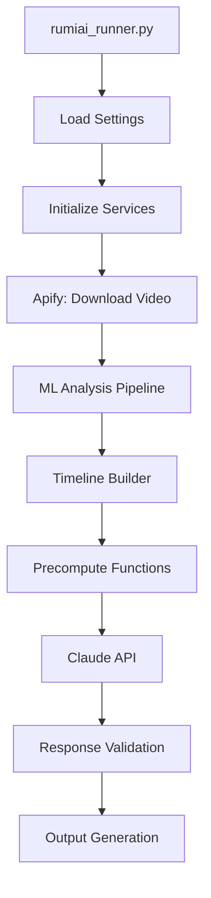

# Complete Dependency Map for ML Precompute Flow

## Table of Contents
1. [Execution Flow Overview](#execution-flow-overview)
2. [Environment Variables](#environment-variables)
3. [Entry Point and Core Files](#entry-point-and-core-files)
4. [Configuration System](#configuration-system)
5. [API Integrations](#api-integrations)
6. [ML Services and Analysis](#ml-services-and-analysis)
7. [Data Processing Pipeline](#data-processing-pipeline)
8. [Precompute Functions](#precompute-functions)
9. [Prompt Management](#prompt-management)
10. [Validation and Output](#validation-and-output)
11. [File I/O Structure](#file-io-structure)
12. [Python Package Dependencies](#python-package-dependencies)
13. [Node.js Integration Layer](#nodejs-integration-layer)
14. [System Dependencies](#system-dependencies)
15. [Missing/Broken Dependencies](#missingbroken-dependencies)
16. [Additional ML Implementation Scripts](#additional-ml-implementation-scripts)

## Execution Flow Overview



## Environment Variables

### Required API Keys
```bash
CLAUDE_API_KEY          # Anthropic API key for Claude
APIFY_API_TOKEN         # Apify API token for TikTok scraping
```

### Feature Flags (Set by User)
```bash
USE_ML_PRECOMPUTE=true      # Enables ML precompute mode
USE_CLAUDE_SONNET=true      # Uses Claude Sonnet instead of Haiku
OUTPUT_FORMAT_VERSION=v2    # Uses 6-block output format
```

### Optional Configuration
```bash
# Logging
LOG_LEVEL=INFO              # Default: INFO
COLORED_LOGS=true           # Default: true

# Processing Limits
MAX_VIDEO_DURATION=180      # Default: 180 seconds
DEFAULT_FPS=2               # Default: 2 fps for analysis
PROMPT_DELAY=10             # Default: 10 seconds between prompts

# Directories (auto-created if missing)
ML_OUTPUTS_DIR=ml_outputs
INSIGHTS_DIR=insights
TEMP_DIR=temp
UNIFIED_ANALYSIS_DIR=unified_analysis
TEMPORAL_MARKERS_DIR=temporal_markers
```

## Entry Point and Core Files

### 1. Main Entry Point
**File**: `scripts/rumiai_runner.py`
```python
# Key imports
from rumiai_v2.api import ClaudeClient, ApifyClient, MLServices
from rumiai_v2.processors import (
    VideoAnalyzer, TimelineBuilder, TemporalMarkerProcessor,
    MLDataExtractor, PromptBuilder, OutputAdapter,
    get_compute_function, COMPUTE_FUNCTIONS
)
from rumiai_v2.prompts import PromptManager
from rumiai_v2.core.models import PromptType, PromptBatch, VideoMetadata
from rumiai_v2.config import Settings
from rumiai_v2.utils import FileHandler, Logger, Metrics, VideoProcessingMetrics
from rumiai_v2.validators import ResponseValidator

# Additional standard library imports
import sys, asyncio, logging, argparse, json, os, time, psutil, gc
from pathlib import Path
from typing import Dict, Any, Optional
from dotenv import load_dotenv

# Main class
class RumiAIRunner:
    def __init__(self):
        self.settings = Settings()
        self.apify = ApifyClient(self.settings.apify_token)
        self.claude = ClaudeClient(self.settings.claude_api_key, self.settings.claude_model)
        self.ml_services = MLServices()
        self.video_analyzer = VideoAnalyzer(self.ml_services)
        self.timeline_builder = TimelineBuilder()
        self.temporal_processor = TemporalMarkerProcessor()
        self.ml_extractor = MLDataExtractor()
        self.prompt_builder = PromptBuilder(self.settings._prompt_templates)
        self.prompt_manager = PromptManager()
        self.output_adapter = OutputAdapter()
```

### 2. Settings Configuration
**File**: `rumiai_v2/config/__init__.py`
```python
class Settings:
    # Loads from environment and provides defaults
    def __init__(self):
        self.claude_api_key = os.getenv('CLAUDE_API_KEY')
        self.apify_api_token = os.getenv('APIFY_API_TOKEN')
        self.use_ml_precompute = os.getenv('USE_ML_PRECOMPUTE', 'false').lower() == 'true'
        self.use_claude_sonnet = os.getenv('USE_CLAUDE_SONNET', 'false').lower() == 'true'
        self.output_format_version = os.getenv('OUTPUT_FORMAT_VERSION', 'v1')
```

## Configuration System

### Directory Structure Required
```
RumiAIv2-clean/
├── venv/                          # Python virtual environment
├── scripts/
│   ├── rumiai_runner.py          # Entry point
│   └── compatibility_wrapper.js  # Node.js bridge to Python
├── rumiai_v2/
│   ├── __init__.py
│   ├── config/
│   │   ├── __init__.py           # Package init
│   │   └── settings.py           # Settings class
│   ├── api/
│   │   ├── __init__.py
│   │   ├── apify_client.py       # TikTok scraping
│   │   ├── claude_client.py      # Claude API
│   │   └── ml_services.py        # ML service wrappers
│   ├── core/
│   │   ├── __init__.py
│   │   ├── exceptions.py         # Custom exceptions
│   │   ├── models/
│   │   │   ├── __init__.py
│   │   │   ├── analysis.py       # UnifiedAnalysis, MLAnalysisResult
│   │   │   ├── prompt.py         # PromptType, PromptBatch, PromptResult
│   │   │   ├── timeline.py       # Timeline, TimelineEntry
│   │   │   ├── timestamp.py      # Timestamp
│   │   │   └── video.py          # VideoMetadata
│   │   └── validators/
│   │       ├── __init__.py
│   │       ├── ml_data_validator.py
│   │       ├── timeline_validator.py
│   │       └── timestamp_validator.py
│   ├── processors/
│   │   ├── __init__.py
│   │   ├── video_analyzer.py     # ML analysis orchestration
│   │   ├── timeline_builder.py   # Timeline construction
│   │   ├── temporal_markers.py   # TemporalMarkerProcessor
│   │   ├── ml_data_extractor.py  # MLDataExtractor
│   │   ├── prompt_builder.py     # PromptBuilder
│   │   ├── output_adapter.py     # OutputAdapter
│   │   ├── precompute_functions.py      # Wrapper functions
│   │   └── precompute_functions_full.py # Actual compute logic
│   ├── prompts/
│   │   ├── __init__.py
│   │   └── prompt_manager.py     # Template management
│   ├── utils/
│   │   ├── __init__.py
│   │   ├── file_handler.py       # File I/O utilities
│   │   ├── logger.py             # Logging setup
│   │   └── metrics.py            # Metrics, VideoProcessingMetrics
│   └── validators/
│       ├── __init__.py
│       └── response_validator.py # 6-block validation
├── prompt_templates/             # Claude prompt templates
│   ├── creative_density_v2.txt
│   ├── emotional_journey_v2.txt
│   ├── speech_analysis_v2.txt
│   ├── visual_overlay_analysis_v2.txt
│   ├── metadata_analysis_v2.txt
│   ├── person_framing_v2.txt
│   └── scene_pacing_v2.txt
└── Output directories (auto-created):
    ├── temp/                     # Downloaded videos
    ├── insights/                 # Claude analysis results
    ├── unified_analysis/         # Combined ML data
    ├── temporal_markers/         # Time-based markers
    ├── object_detection_outputs/ # YOLO results
    ├── speech_transcriptions/    # Whisper results
    ├── human_analysis_outputs/   # MediaPipe results
    ├── creative_analysis_outputs/# OCR results
    └── scene_detection_outputs/  # Scene detection results
```

## API Integrations

### 1. Apify API (TikTok Scraping)
**File**: `rumiai_v2/api/apify_client.py`
```python
# Dependencies
import aiohttp
import requests

class ApifyClient:
    BASE_URL = "https://api.apify.com/v2"
    ACTOR_ID = "GdWCkxBtKWOsKjdch"  # TikTok scraper actor
    
    # Required methods
    async def scrape_video(video_url: str) -> Dict
    async def download_video(video_id: str) -> str
```

### 2. Claude API (Anthropic)
**File**: `rumiai_v2/api/claude_client.py`
```python
# Dependencies
from anthropic import Anthropic

class ClaudeClient:
    MODELS = {
        'haiku': 'claude-3-haiku-20240307',
        'sonnet': 'claude-3-5-sonnet-20241022'
    }
    
    MODEL_PRICING = {
        "claude-3-haiku-20240307": {"input": 0.25, "output": 1.25},
        "claude-3-5-sonnet-20241022": {"input": 3.00, "output": 15.00}
    }
```

## ML Services and Analysis

### 1. ML Services Wrapper
**File**: `rumiai_v2/api/ml_services.py`
```python
# Dependencies
import subprocess
import ffmpeg

class MLServices:
    # YOLO Object Detection
    async def run_yolo(video_path: str) -> Dict
    # Currently returns empty results - NEEDS IMPLEMENTATION
    # Should use: ultralytics (YOLOv8)
    
    # Whisper Transcription
    async def run_whisper(video_path: str) -> Dict
    # Tries to run: venv/bin/python whisper_transcribe.py
    # MISSING FILE: whisper_transcribe.py
    # Should use: openai-whisper
    
    # MediaPipe Human Analysis
    async def run_mediapipe(video_path: str) -> Dict
    # Returns empty results - NEEDS IMPLEMENTATION
    # Should use: mediapipe
    
    # OCR Text Detection
    async def run_ocr(video_path: str) -> Dict
    # Returns empty results - NEEDS IMPLEMENTATION
    # Should use: easyocr
    
    # Scene Detection
    async def run_scene_detection(video_path: str) -> Dict
    # Has actual implementation using PySceneDetect
    # Uses: scenedetect library
```

### 2. Video Analyzer
**File**: `rumiai_v2/processors/video_analyzer.py`
```python
# Dependencies
import asyncio
from concurrent.futures import ThreadPoolExecutor

class VideoAnalyzer:
    ML_TYPES = ['yolo', 'whisper', 'mediapipe', 'ocr', 'scene_detection']
    
    async def analyze(video_path: str) -> UnifiedAnalysis:
        # Runs all ML analyses in parallel
        # Saves results to respective output directories
```

## Data Processing Pipeline

### 1. Timeline Builder
**File**: `rumiai_v2/processors/timeline_builder.py`
```python
class TimelineBuilder:
    def build_timeline(analysis: UnifiedAnalysis) -> Timeline:
        # Combines all ML outputs into unified timeline
        # Entry types: 'object', 'speech', 'gesture', 'face', 'text_overlay', 'scene_change'
```

### 2. Temporal Marker Generator
**File**: `rumiai_v2/processors/temporal_markers.py`
```python
class TemporalMarkerGenerator:
    def generate_markers(analysis: UnifiedAnalysis) -> Dict:
        # Creates time-based markers for key events
        # Identifies patterns and highlights
```

## Precompute Functions

### 1. Wrapper Functions
**File**: `rumiai_v2/processors/precompute_functions.py`
```python
# Maps prompt types to compute functions
COMPUTE_FUNCTIONS = {
    'creative_density': compute_creative_density_wrapper,
    'emotional_journey': compute_emotional_wrapper,
    'person_framing': compute_person_framing_wrapper,
    'scene_pacing': compute_scene_pacing_wrapper,
    'speech_analysis': compute_speech_wrapper,
    'visual_overlay_analysis': compute_visual_overlay_wrapper,
    'metadata_analysis': compute_metadata_wrapper
}

# Each wrapper extracts data from unified analysis and calls actual compute function
def compute_creative_density_wrapper(analysis_dict: Dict) -> Dict:
    timelines = _extract_timelines_from_analysis(analysis_dict)
    duration = analysis_dict.get('timeline', {}).get('duration', 0)
    return compute_creative_density_analysis(timelines, duration)
```

### 2. Actual Compute Functions
**File**: `rumiai_v2/processors/precompute_functions_full.py`
```python
# Each function generates 30-50 metrics from ML data
def compute_creative_density_analysis(timelines: Dict, duration: float) -> Dict:
    # Returns: avgDensity, maxDensity, elementCounts, densityCurve, etc.

def compute_emotional_metrics(timelines, speech_timeline, gesture_timeline, duration) -> Dict:
    # Returns: emotionTransitions, dominantEmotion, emotionalArc, etc.

# ... 5 more compute functions ...
```

## Prompt Management

### 1. Prompt Manager
**File**: `rumiai_v2/prompts/prompt_manager.py`
```python
class PromptManager:
    def __init__(self, template_dir: str = "prompt_templates"):
        # Loads all _v2.txt templates at startup
        
    def format_prompt(prompt_type: str, context: Dict) -> str:
        # Inserts precomputed metrics into template
        # Adds context data and formatting
```

### 2. Prompt Templates
**Directory**: `prompt_templates/`
- Each template defines expected 6-block output structure
- Contains instructions for JSON-only output
- Defines specific metrics for each block type

## Validation and Output

### 1. Response Validator
**File**: `rumiai_v2/validators/response_validator.py`
```python
class ResponseValidator:
    EXPECTED_BLOCKS = ['CoreMetrics', 'Dynamics', 'Interactions', 
                       'KeyEvents', 'Patterns', 'Quality']
    
    # Block name mappings for each prompt type
    BLOCK_NAME_MAPPINGS = {
        'creative_density': {
            'densityCoreMetrics': 'CoreMetrics',
            'densityDynamics': 'Dynamics',
            # ... etc
        }
    }
    
    @classmethod
    def validate_6block_response(response_text: str, prompt_type: str) -> Tuple[bool, Dict, List]:
        # Validates JSON structure
        # Normalizes block names
        # Checks required fields
```

### 2. Output Adapter
**File**: `rumiai_v2/processors/output_adapter.py`
```python
class OutputAdapter:
    def convert_6block_to_legacy(data: Dict, prompt_type: str) -> Dict:
        # Converts v2 format to v1 for backward compatibility
```

## File I/O Structure

### Input Files
```
temp/
└── {video_id}.mp4                # Downloaded TikTok video
```

### ML Output Files
```
object_detection_outputs/
└── {video_id}/
    └── {video_id}_yolo_detections.json

speech_transcriptions/
└── {video_id}_whisper.json

human_analysis_outputs/
└── {video_id}/
    └── {video_id}_human_analysis.json

creative_analysis_outputs/
└── {video_id}/
    └── {video_id}_creative_analysis.json

scene_detection_outputs/
└── {video_id}/
    └── {video_id}_scenes.json
```

### Analysis Output Files
```
unified_analysis/
└── {video_id}.json               # Combined ML data

temporal_markers/
└── {video_id}_{timestamp}.json   # Time-based markers

insights/
└── {video_id}/
    ├── creative_density/
    │   └── creative_density_complete_{timestamp}.json
    ├── emotional_journey/
    │   └── emotional_journey_complete_{timestamp}.json
    └── ... (5 more prompt types)
```

## Python Package Dependencies

### Core Requirements (from requirements.txt)
```txt
# API Clients
anthropic==0.7.8
aiohttp==3.9.1
requests==2.31.0

# Video Processing
opencv-python-headless==4.8.1.78
moviepy==1.0.3
ffmpeg-python==0.2.0

# ML Models
openai-whisper==20231117    # OpenAI Whisper
ultralytics==8.0.200        # YOLOv8
mediapipe==0.10.8           # Google MediaPipe
easyocr==1.7.0              # OCR
torch==2.1.0                # PyTorch (for ML models)
torchvision==0.16.0         # PyTorch vision
transformers==4.35.2        # Hugging Face
CLIP @ git+https://github.com/openai/CLIP.git  # OpenAI CLIP

# Additional ML Libraries
scenedetect[opencv]==0.6.2  # Scene detection
deep-sort-realtime==1.3.2   # Object tracking

# Data Processing
numpy==1.24.3
pandas==2.1.3
scipy==1.11.4
scikit-learn==1.3.2
pillow==10.1.0              # Image processing

# Utilities
python-dotenv==1.0.0
psutil==5.9.6               # System monitoring
colorama==0.4.6             # Colored logs
tqdm==4.66.1                # Progress bars

# Additional Dependencies
dataclasses                 # Standard library (Python 3.7+)
typing                      # Standard library
pathlib                     # Standard library
```

### Development Dependencies
```txt
pytest==7.4.3
pytest-asyncio==0.21.1
black==23.11.0
flake8==6.1.0
mypy==1.7.1
```

### Multiple Requirements Files
- `requirements.txt` - Main requirements
- `requirements_exact.txt` - Pinned versions for reproducibility
- `requirements_py312.txt` - Python 3.12 specific requirements
- `rumiai_v2_requirements.txt` - V2 specific requirements

## Node.js Integration Layer

### Node.js Dependencies (from package.json)
```json
{
  "dependencies": {
    "apify-client": "^2.7.1",         // Apify API client
    "axios": "^1.5.0",                // HTTP client
    "dotenv": "^16.3.1",              // Environment variables
    "express": "^4.18.2",             // Web server
    "cors": "^2.8.5",                 // CORS middleware
    "express-rate-limit": "^7.1.5",   // Rate limiting
    "@google-cloud/storage": "^7.7.0", // GCS integration
    "@google-cloud/video-intelligence": "^5.0.0", // Google Video AI
    "puppeteer-core": "^24.10.0",     // Browser automation
    "ytdl-core": "^4.11.5",           // YouTube downloader
    "chart.js": "^4.4.0",             // Charting
    "jspdf": "^2.5.1",                // PDF generation
    "moment": "^2.29.4",              // Date manipulation
    "cheerio": "^1.0.0"               // HTML parsing
  }
}
```

### JavaScript Files Interacting with rumiai_runner.py
1. **scripts/compatibility_wrapper.js**
   - Main Node.js wrapper for rumiai_runner.py
   - Uses `child_process.spawn()` to execute Python

2. **server/services/**
   - `LocalVideoAnalyzer.js` - Runs ML analysis scripts
   - `TemporalMarkerService.js` - Temporal marker generation
   - `WhisperTranscriptionService.js` - Speech transcription
   - `ClaudeService.js` - Claude API integration

3. **Integration Scripts**
   - `run_claude_prompts_with_delays.js` - Batch prompt execution
   - `test_rumiai_complete_flow.js` - End-to-end testing
   - `resume_analysis.js` - Resume interrupted analysis
   - `UnifiedTimelineAssembler.js` - Timeline assembly

### Communication Protocol
- Node.js spawns Python processes using `child_process`
- Data exchange via JSON through stdout/stdin
- Environment variables passed to Python processes
- Exit codes indicate success/failure types

## System Dependencies

### Required System Packages
```bash
# Video Processing
ffmpeg                      # Video manipulation
libglib2.0-0               # MediaPipe dependency
libsm6                     # OpenCV dependency
libxext6                   # OpenCV dependency
libxrender-dev             # OpenCV dependency
libgomp1                   # OpenCV dependency

# ML Acceleration (Optional)
cuda-toolkit-11.x          # For GPU acceleration
cudnn                      # Deep learning primitives
```

### Hardware Requirements
- **Minimum RAM**: 4GB
- **Recommended RAM**: 8GB+
- **GPU**: Optional but STRONGLY recommended
  - NVIDIA GPU with CUDA support provides 10-30x speedup
  - System automatically uses GPU when available
  - Falls back to CPU if no GPU detected
  - Check GPU availability with `nvidia-smi` command
- **Storage**: 10GB+ for models and outputs

### CRITICAL: PyTorch Installation
**Important**: The original RumiAIv2-clean uses GPU-accelerated PyTorch. When copying/setting up the repository:

1. **First, check if you have an NVIDIA GPU:**
   ```bash
   nvidia-smi
   # If this shows GPU info, you MUST use CUDA version
   # If "command not found", use CPU version
   ```

2. **Install the appropriate PyTorch version:**
   ```bash
   # For systems WITH NVIDIA GPU (RECOMMENDED):
   pip install torch torchvision --index-url https://download.pytorch.org/whl/cu118
   
   # For systems WITHOUT GPU (CPU only):
   pip install torch torchvision --index-url https://download.pytorch.org/whl/cpu
   ```

3. **Set environment variable accordingly:**
   ```bash
   # In .env file:
   RUMIAI_USE_GPU=true   # If GPU available
   RUMIAI_USE_GPU=false  # If CPU only
   ```

**Note**: Installing CPU-only PyTorch when GPU is available will result in significantly slower processing!

## Missing/Broken Dependencies

### 1. Missing ML Script
**File**: `whisper_transcribe.py`
- Referenced by MLServices but doesn't exist
- Should be created in project root or ml_scripts/

### 2. Unimplemented ML Services
- YOLO service returns empty results
- MediaPipe service returns empty results
- OCR service returns empty results

### 3. Missing Model Files
- Whisper models need to be downloaded
- YOLO models need to be downloaded
- EasyOCR models download on first use

### 4. Configuration Files (Optional)
- `.env` file for environment variables
- `config.yaml` for advanced settings (not implemented)

## Initialization Sequence

1. **Load Environment Variables**
   ```python
   # From environment or .env file
   load_dotenv()
   ```

2. **Initialize Settings**
   ```python
   settings = Settings()
   # Validates API keys exist
   ```

3. **Create Output Directories**
   ```python
   for directory in OUTPUT_DIRS:
       os.makedirs(directory, exist_ok=True)
   ```

4. **Initialize Services**
   ```python
   apify = ApifyClient(settings.apify_api_token)
   claude = ClaudeClient(settings.claude_api_key)
   video_analyzer = VideoAnalyzer()
   ```

5. **Load ML Models (Lazy)**
   ```python
   # Models loaded on first use to save memory
   ```

6. **Load Prompt Templates**
   ```python
   prompt_manager = PromptManager()
   # Loads all _v2.txt templates
   ```

## Error Recovery

### API Failures
- Apify: Retries with exponential backoff
- Claude: Retries up to 3 times
- ML Services: Currently no retry (should be added)

### File I/O Errors
- Auto-creates missing directories
- Logs warnings for missing files
- Falls back to empty data (problematic)

### Memory Management
- Monitors memory usage
- Triggers garbage collection at 4GB
- Should implement OOM prevention

## Testing the Flow

### 1. Verify Environment
```bash
# Check Python version
python --version  # Should be 3.8+

# Check virtual environment
source venv/bin/activate

# Check packages
pip list | grep -E "anthropic|aiohttp|opencv|whisper"
```

### 2. Test ML Services
```python
# Test each ML service individually
python -c "from rumiai_v2.api.ml_services import MLServices; print(MLServices())"
```

### 3. Run Full Pipeline
```bash
# Set environment
export CLAUDE_API_KEY="your-key"
export APIFY_API_TOKEN="your-token"
export USE_ML_PRECOMPUTE=true
export USE_CLAUDE_SONNET=true
export OUTPUT_FORMAT_VERSION=v2

# Run
./venv/bin/python scripts/rumiai_runner.py "video-url"
```

## Additional ML Implementation Scripts

### Standalone ML Scripts
These scripts provide actual ML functionality but are not directly called by rumiai_runner.py:

1. **mediapipe_human_detector.py**
   - Implements MediaPipe human detection
   - Could replace empty MediaPipe implementation in MLServices

2. **detect_tiktok_creative_elements.py**
   - Comprehensive ML analysis using:
     - YOLOv8 for object detection
     - EasyOCR for text detection
     - MediaPipe for gesture detection
   - Contains working implementations that MLServices lacks

3. **local_analysis/** directory:
   - `enhanced_human_analyzer.py` - MediaPipe human analysis
   - `object_tracking.py` - YOLOv8 + DeepSort tracking
   - `scene_detection.py` - PySceneDetect implementation
   - `scene_labeling.py` - Scene classification
   - `content_moderation.py` - Content safety checks
   - `frame_sampler.py` - Frame extraction utilities

### Shell Script Wrappers
- `setup.sh` - Initial environment setup
- `safe_video_analysis.sh` - Safe execution wrapper
- `run_tests.sh` - Test execution

### Configuration Files
- `config/temporal_markers.json` - Temporal marker settings
- `.env.example` - Environment variable template
- `Dockerfile` - Container configuration

## Common Issues and Solutions

1. **"No such file or directory: whisper_transcribe.py"**
   - Create the missing script or fix MLServices to use whisper directly
   - Alternative: Use implementation from detect_tiktok_creative_elements.py

2. **Empty ML results**
   - Implement actual ML service methods
   - Use code from standalone ML scripts as reference
   - Ensure models are downloaded

3. **Low confidence scores**
   - Fix ML data extraction
   - Ensure precompute functions receive proper data
   - Check that ML services return data in expected format

4. **High API costs**
   - Add data quality checks before Claude calls
   - Use Haiku for low-quality data
   - Implement prompt size validation

5. **Memory issues**
   - rumiai_runner.py includes memory monitoring
   - Triggers garbage collection at 4GB threshold
   - Consider implementing model unloading

## Essential Files for rumiai_runner.py

To support rumiai_runner.py, these are the minimum required components:

### Core Python
- `scripts/rumiai_runner.py`
- `rumiai_v2/` (entire package)
- All `requirements*.txt` files

### ML Implementation
- `local_analysis/` directory (for actual ML functionality)
- `mediapipe_human_detector.py`
- `detect_tiktok_creative_elements.py`

### Configuration
- `prompt_templates/` directory
- `config/` directory
- `.env` file (from .env.example)

### Node.js Integration (if using Node.js frontend)
- `scripts/compatibility_wrapper.js`
- `package.json`
- Selected files from `server/services/`

### Infrastructure
- `setup.sh`
- `Dockerfile` (for containerization)
- `venv/` (Python virtual environment)

This dependency map provides a complete view of the ML precompute system, highlighting both working components and areas needing fixes. The analysis reveals that while rumiai_runner.py is well-structured, it depends on ML service implementations that are currently placeholders, with the actual working code existing in standalone scripts outside the main package.