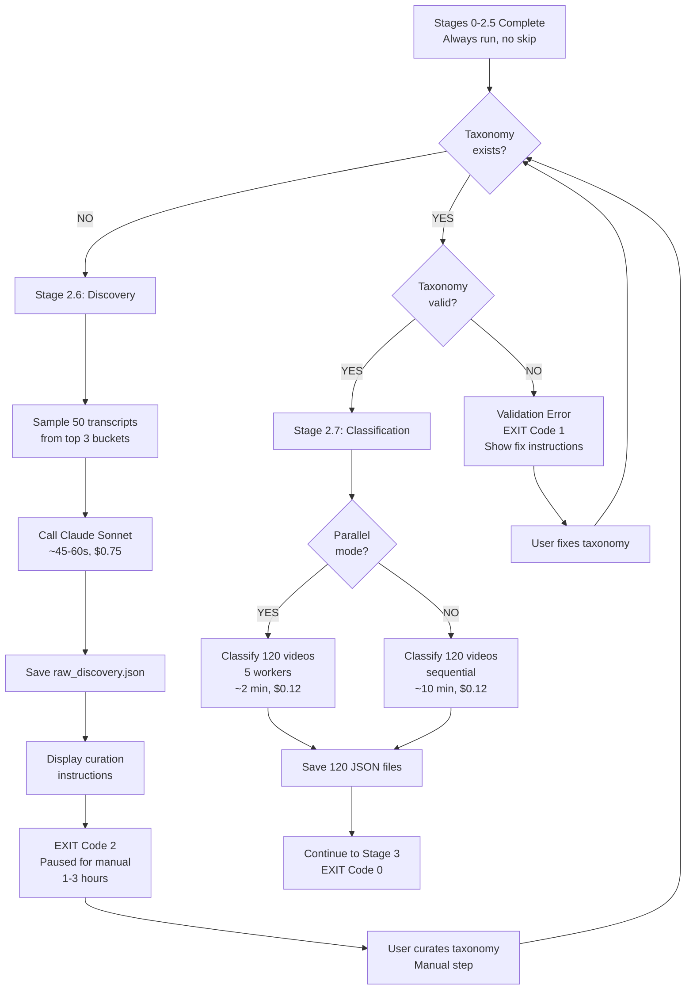

# Stage 2.6/2.7 Pipeline Integration Documentation

> **Document**: 2.6PipeIntegration.md
> **Purpose**: Integration specification for Content Analysis stages into rumiai_ml_batch.py
> **Parent**: MLPlanningv2.md Section "Stage 2.6 & 2.7"
> **TI Spec**: ContentAnalysisCHILDTI.md
> **Version**: 2.1 - Production Ready
> **Date**: 2025-01-28
> **Last Updated**: 2025-01-28 (✅ ALL 21 CRITIQUE ISSUES RESOLVED)

---

## Critique Resolution Tracker

| Issue | Status | Resolution |
|-------|--------|------------|
| **C1: Pipeline State Management Conflict** | ✅ **DONE** | Option B: Separate minimal `.content_analysis_state.json` for taxonomy tracking only. Stage 2 checkpoints remain unchanged for video processing. Clear separation of concerns. |
| **C2: Stage 0-2.5 Resume Behavior Undefined** | ✅ **DONE** | Option A: Stages 0-2.5 always run (current behavior). No skip logic added. Only Stage 2.6/2.7 have intelligent skip (taxonomy existence). Keeps scope focused, leverages existing Stage 2 checkpoints. |
| **C3: Exit Code 0 is Misleading** | ✅ **DONE** | Option A: Use exit code 2 for "paused for manual step". Clear semantics: 0=complete, 1=error, 2=paused, 130=interrupted. CI/CD friendly, follows Unix conventions. |
| **M1: Multi-Hashtag Cluster Support** | ✅ **DONE** | Option A: Single shared taxonomy for cluster. Discovery samples from all hashtags, creates unified taxonomy. Added cluster mode support documentation. |
| **M2: Taxonomy Update/Versioning** | ⏭️ **SKIP** | Option C: Manual backup workflow documented, versioning deferred to Phase 3 |
| **M3: Stage 2.7 Failure Recovery** | ✅ **DONE** | Option B: State updates only after full completion (already correct behavior) |
| **M4: Parallel Mode Default** | ✅ **DONE** | Option A: Changed to `false` default (sequential), matches TI spec |
| **M5: Manual Curation Time** | ✅ **DONE** | Option B: Changed to range "1-3 hours depending on complexity" |
| **m1: Inconsistent Path Examples** | ✅ **DONE** | Option A: Added path template variables section, aligned with MLPlanningv2.md architecture. All paths use `{analysis_base}` notation. |
| **m2-m10, D1-D3** | ✅ **DONE** | Processed per user selections |

---

## Table of Contents

1. [Overview](#overview)
2. [Exit Codes](#exit-codes)
3. [Integration Architecture](#integration-architecture)
4. [Pipeline Flow](#pipeline-flow)
5. [Implementation Details](#implementation-details)
6. [Error Handling](#error-handling)
7. [User Experience](#user-experience)
8. [Testing Strategy](#testing-strategy)
9. [Code Changes](#code-changes)

---

## Overview

### Purpose

Integrate Stage 2.6 (Pattern Discovery) and Stage 2.7 (Video Classification) into the main ML pipeline runner (`rumiai_ml_batch.py`) with intelligent resume behavior and clear user guidance for the manual curation step.

### Key Requirements

1. **Automatic Stage Detection**: Pipeline detects whether taxonomy exists and runs appropriate stage
2. **Graceful Pause**: Stage 2.6 completes, prompts user for curation, then exits gracefully
3. **Seamless Resume**: Stage 2.7 auto-runs on next pipeline execution after curation
4. **Validation First**: Taxonomy validated before classification to catch errors early
5. **Parallel Support**: Stage 2.7 supports parallel mode for 5x speedup
6. **Checkpoint Resume**: Stage 2.7 uses checkpoints for interrupt recovery

### Design Principles

- **One Command**: User runs same command for both initial setup and subsequent runs
- **Clear Prompts**: User receives clear instructions when manual curation needed
- **Fail-Fast**: Invalid taxonomy causes immediate failure with actionable error messages
- **Skip-Smart**: If taxonomy exists and is valid, Stage 2.6 is skipped automatically
- **No Side Scripts**: No separate scripts needed - everything integrated into main pipeline

---

## Exit Codes

**Design Decision (C3 Resolution)**: Use exit code 2 to indicate "paused for manual curation"

### Exit Code Reference

| Code | Meaning | Description | Next Action |
|------|---------|-------------|-------------|
| **0** | Success | Pipeline completed fully | Proceed to analysis/reports |
| **1** | Error | Pipeline failed (missing inputs, validation errors, etc.) | Check logs, fix issue, re-run |
| **2** | Paused | Manual curation needed (Stage 2.6 complete) | Complete taxonomy curation, re-run pipeline |
| **130** | Interrupted | User pressed Ctrl+C | Resume with same command (uses checkpoints) |

### Why Exit Code 2?

1. **Unix Convention**: Code 2 commonly means "cannot continue without user intervention"
2. **CI/CD Friendly**: Automation can detect incomplete state programmatically
3. **Clear Semantics**: 0=done, 1=error, 2=paused, 130=interrupted
4. **Standard Practice**: Follows tradition of 0=success, 1=error, 2+=special states
5. **Non-Breaking**: Most scripts check for non-zero (code 2 is non-zero = needs attention)

### CI/CD Integration Examples

**GitHub Actions**:
```yaml
- name: Run RumiAI Pipeline
  id: pipeline
  run: python rumiai_ml_batch.py --client acme --target nutrition
  continue-on-error: true

- name: Handle Pipeline Status
  run: |
    EXIT_CODE=${{ steps.pipeline.outputs.exit_code }}
    if [ $EXIT_CODE -eq 0 ]; then
      echo "✅ Pipeline complete"
    elif [ $EXIT_CODE -eq 2 ]; then
      echo "⏸️  Manual curation needed"
      # Send notification, create Jira ticket, etc.
      gh issue create --title "Manual Curation Needed: nutrition" \
                       --body "Stage 2.6 complete. Please curate taxonomy."
    else
      echo "❌ Pipeline failed"
      exit 1
    fi
```

**Bash Script**:
```bash
#!/bin/bash
python rumiai_ml_batch.py --client "$CLIENT" --target "$HASHTAG"
EXIT_CODE=$?

case $EXIT_CODE in
  0)
    echo "Pipeline complete - proceeding to next step"
    ./generate_reports.sh
    ;;
  2)
    echo "Manual curation needed"
    echo "1. Edit: $TAXONOMY_PATH"
    echo "2. Re-run: python rumiai_ml_batch.py --client $CLIENT --target $HASHTAG"
    exit 0  # Not an error, just paused
    ;;
  130)
    echo "Pipeline interrupted - re-run to resume"
    exit 0
    ;;
  *)
    echo "Pipeline failed with code $EXIT_CODE"
    exit 1
    ;;
esac
```

---

## Quick Reference (m7 Resolution)

| Scenario | Command | Exit Code | What Happens |
|----------|---------|-----------|--------------|
| **First run (fresh)** | `python rumiai_ml_batch.py --client X --target Y` | 2 | Runs through Stage 2.6, pauses for curation |
| **After curation** | `python rumiai_ml_batch.py --client X --target Y` | 0 | Skips 2.6, runs 2.7, completes pipeline |
| **Validate taxonomy** | `python run_stage_2_7.py --client X --hashtag Y --validate-only` | 0 or 1 | Quick validation check |
| **Re-classify only** | `python run_stage_2_7.py --client X --hashtag Y` | 0 or 1 | Skips Stages 0-2.5, faster |
| **Start over** | `rm {path}/taxonomy.json && python rumiai_ml_batch.py ...` | 2 | Deletes taxonomy, re-runs discovery |
| **Enable parallel** | `export ENABLE_PARALLEL_CLASSIFICATION=true && python rumiai_ml_batch.py ...` | varies | 5x faster classification |

**Key Files**:
- Discovery output: `{analysis_base}/content_taxonomies/{hashtag}_raw_discovery.json`
- Curated taxonomy: `{analysis_base}/content_taxonomies/{hashtag}_taxonomy.json` (you create this)
- State file: `{analysis_base}/.content_analysis_state.json`
- Classification outputs: `{analysis_base}/content_analysis/{video_id}_content.json` (120 files)

---

## Path Template Variables (m1 Resolution)

**Alignment with MLPlanningv2.md Architecture**:

This document uses the same path notation as the parent MLPlanningv2.md for consistency.

### Template Variable Definitions

| Variable | Example Value | Description |
|----------|---------------|-------------|
| `{client_id}` | `acme_corp` | Client identifier (sanitized) |
| `{cluster_id}` | `nutrition` | Hashtag cluster name (or single hashtag without #) |
| `{mode}` | `top` | Analysis mode: `top` or `recent` |
| `{strategy}` | `contrastive` | Selection strategy: `contrastive` or `top` |
| `{analysis_base}` | See below | Full analysis directory path |
| `{hashtag}` | `nutrition` | Clean hashtag name (same as cluster_id for single hashtags) |
| `{video_id}` | `7526250443832331550` | TikTok video identifier |
| `{bucket}` | `33-60s` | Duration bucket (e.g., `0-3s`, `33-60s`) |

### Path Construction

**Base Path**:
```
{analysis_base} = /data/clients/{client_id}/hashtags/{cluster_id}/{mode}_{strategy}
```

**Example**:
```
Client: acme_corp
Cluster: nutrition
Mode: top
Strategy: contrastive

→ {analysis_base} = /data/clients/acme_corp/hashtags/nutrition/top_contrastive
```

**Content Analysis Paths**:
```
{analysis_base}/content_taxonomies/              # Taxonomy storage
{analysis_base}/content_taxonomies/{hashtag}_raw_discovery.json
{analysis_base}/content_taxonomies/{hashtag}_taxonomy.json
{analysis_base}/.content_analysis_state.json     # State tracking
{analysis_base}/content_analysis/                # Classification outputs
{analysis_base}/content_analysis/{video_id}_content.json
{analysis_base}/.checkpoints/                    # Checkpoint storage
{analysis_base}/.checkpoints/classification_checkpoint.json
```

**Note**: For cluster mode (M1), `{cluster_id}` represents the cluster (e.g., "nutrition"), and `{hashtag}` is the same value for single shared taxonomy.

---

## Cluster Mode Support (M1 Resolution)

**Design Decision**: Single shared taxonomy for entire hashtag cluster

### How It Works

**Cluster Definition** (from MLPlanningv2.md):
```json
// /config/hashtag_clusters/nutrition.json
{
  "cluster_id": "nutrition",
  "hashtags": ["#nutrition", "#nutritionist", "#nutritiontips", "#nutritioncoach"],
  "scrape_rounds": 2
}
```

**Cluster Scraping** (Stage 1):
- 4 hashtags × 2 rounds = 8 scrapes
- ~1,900 videos scraped → ~1,400 unique after deduplication
- Each video tracks provenance (`source_hashtags`, `source_runs`)

**Stage 2.6 Discovery** (Cluster Mode):
- **Sampling**: 50 transcripts sampled from **all cluster videos** (not per-hashtag)
  - Example: 12-13 videos from `#nutrition`, 12-13 from `#nutritionist`, etc.
  - Stratified by source hashtag to ensure representation
- **Discovery**: Creates **single unified taxonomy** representing patterns across entire cluster
- **Output**: `{cluster_id}_raw_discovery.json` (e.g., `nutrition_raw_discovery.json`)

**Manual Curation** (Same as Before):
- User curates **one taxonomy** for the entire cluster
- Saves as `{cluster_id}_taxonomy.json` (e.g., `nutrition_taxonomy.json`)

**Stage 2.7 Classification** (Cluster Mode):
- **Taxonomy**: Uses **single shared taxonomy** for all videos regardless of source hashtag
- **Rationale**: Semantic clustering is narrow (20-30% overlap), hashtags are related
- **Result**: Unified pattern analysis across cluster

### Why Single Taxonomy (Not Per-Hashtag)

**Advantages**:
1. **Unified Insights**: Cross-hashtag patterns visible (e.g., `#nutritionist` videos use same hooks as `#nutritiontips`)
2. **Less Curation**: 1-3 hours vs 4-12 hours (4 separate taxonomies)
3. **Semantic Coherence**: Narrow clustering means hashtags share vocabulary
4. **Simpler Logic**: No hashtag routing, single classification path

**Trade-offs**:
- May miss hashtag-specific nuances (e.g., `#nutritionist` more professional tone than `#nutritiontips`)
- Can be addressed in Phase 2 with hashtag-specific extensions if needed

### Implementation Notes

**No Code Changes Needed**:
- Discovery already samples from manifest (works with cluster videos)
- Classification already uses single taxonomy (works with cluster)
- Cluster provenance tracked in Stage 1 (outside scope of this doc)

**Path Examples** (Cluster Mode):
```
# Cluster: nutrition (#nutrition, #nutritionist, #nutritiontips, #nutritioncoach)
{analysis_base} = /data/clients/acme_corp/hashtags/nutrition/top_contrastive

# Discovery output (single shared taxonomy)
{analysis_base}/content_taxonomies/nutrition_raw_discovery.json
{analysis_base}/content_taxonomies/nutrition_taxonomy.json

# Classification outputs (all videos use same taxonomy)
{analysis_base}/content_analysis/{video_id}_content.json  # video from #nutrition
{analysis_base}/content_analysis/{video_id2}_content.json # video from #nutritionist
# Both use nutrition_taxonomy.json
```

---

## Integration Architecture

### Pipeline Position

```
Stage 0: Foundation (CLI, Config, Paths)
Stage 1: Video Discovery & Selection
Stage 2: Video Processing (RumiAI)
Stage 2.5: File Organization
└─→ [NEW] Stage 2.6: Content Analysis - Pattern Discovery
    └─→ [PAUSE FOR MANUAL CURATION]
        └─→ [NEW] Stage 2.7: Content Analysis - Video Classification
            └─→ Stage 3: Feature Aggregation (TODO)
                └─→ Stage 4+: ML Pipeline continues...
```

### Execution Flow

#### First Run (No Taxonomy)
```
rumiai_ml_batch.py --client acme --target nutrition
├── Stage 0-2.5: Run (always execute)
├── Stage 2.6: Discovery
│   ├── Check taxonomy exists? NO
│   ├── Sample 50 transcripts
│   ├── Call Claude Sonnet for discovery
│   ├── Save raw_discovery.json
│   ├── Display manual curation instructions
│   └── EXIT with code 2 (paused for manual step)
└── [User performs manual curation]
```

#### Second Run (After Curation)
```
rumiai_ml_batch.py --client acme --target nutrition
├── Stage 0-2.5: Run (always execute, uses Stage 2 checkpoints if interrupted)
├── Stage 2.6: Discovery
│   └── Check taxonomy exists? YES → SKIP
├── Stage 2.7: Classification
│   ├── Validate taxonomy
│   ├── Classify 120 videos (parallel mode)
│   ├── Save 120 classification JSONs
│   └── Continue to Stage 3
└── Stage 3+: Continue pipeline...
```

#### Subsequent Runs (Taxonomy Exists)
```
rumiai_ml_batch.py --client acme --target nutrition
├── Stage 0-2.5: Run (always execute)
├── Stage 2.6: Discovery → SKIP (taxonomy exists)
├── Stage 2.7: Classification
│   ├── Validate taxonomy (fast check)
│   ├── Classify videos (uses existing taxonomy)
│   └── Continue to Stage 3
└── Stage 3+: Continue pipeline...
```

**Note (C2 Resolution)**: Stages 0-2.5 always run from beginning. Only Stage 2.6/2.7 have intelligent skip behavior based on taxonomy existence. This keeps implementation simple and leverages existing Stage 2 checkpoint/resume for video processing interruptions.

---

## Pipeline Flow

### Decision Tree (D3 Resolution - Enhanced)



### State Management

**Design Decision (C1 Resolution)**: Use minimal, purpose-specific state file for content analysis only. Stage 2's per-bucket video processing checkpoints remain unchanged.

**Content Analysis State File**: `{analysis_base}/.content_analysis_state.json`

```json
{
  "taxonomy_discovered": true,
  "taxonomy_curated": true,
  "taxonomy_path": "content_taxonomies/nutrition_taxonomy.json",
  "discovery_date": "2025-01-28T10:30:00Z",
  "classification_date": "2025-01-28T12:45:00Z",
  "last_updated": "2025-01-28T12:45:00Z"
}
```

**State Lifecycle**:
1. **After Stage 2.6 completes**: File created with `taxonomy_discovered=true, taxonomy_curated=false`
2. **After manual curation + validation**: `taxonomy_curated=true` (set automatically when Stage 2.7 validates taxonomy)
3. **After Stage 2.7 completes**: `classification_date` added

**Separation from Stage 2 Checkpoints**:
- **Content analysis state** (`/.content_analysis_state.json`): Hashtag-wide, tracks taxonomy lifecycle
- **Video processing checkpoints** (`/buckets/.../checkpoints/`): Per-bucket, tracks individual video processing
- **No conflicts**: Different purposes, different granularities, different files

**Why This Design (C1 Resolution)**:
1. **Minimal Overhead**: Only 6 fields, updated twice per hashtag lifetime (discovery + classification)
2. **Clear Separation**: Content analysis is fundamentally different from per-video processing
3. **No Duplication**: Taxonomy state is hashtag-wide, not per-bucket (would be duplicated 3x otherwise)
4. **Easy Queries**: Single file check to answer "Has taxonomy been curated?"
5. **Future-Proof**: Easy to extend with version tracking, metrics, etc.
6. **Debugging Value**: Timestamps help diagnose "When did discovery run?" questions

---

### Pipeline Resume Behavior (C2 Resolution)

**Design Decision**: Stages 0-2.5 always run. No automatic stage skipping logic.

**Rationale**:
1. **Scope-Appropriate**: This document integrates Stage 2.6/2.7, not a full pipeline resume redesign
2. **Already Working**: Current pipeline successfully runs Stages 0-2.5; don't fix what isn't broken
3. **Fast Enough**: Stages 0-1 are quick (<5 min), Stage 2 has per-bucket checkpoints for interruptions
4. **Config Safety**: Re-running stages ensures config changes are applied correctly
5. **Simplicity**: No config hashing, no complex resume logic, no edge cases

**Smart Skip Where It Matters**:
- **Stage 2.6 (Discovery)**: Skipped if taxonomy exists (one-time setup)
- **Stage 2.7 (Classification)**: Always runs if taxonomy exists (idempotent, safe to re-run)

**Alternative for Stage 2.6/2.7 Only**:

If you need to run **only** Stage 2.6/2.7 (e.g., after manually fixing taxonomy), use standalone scripts:

```bash
# Run discovery only
python run_stage_2_6.py --client acme --hashtag nutrition

# Run classification only (requires taxonomy exists)
python run_stage_2_7.py --client acme --hashtag nutrition

# Or validate taxonomy without running anything
python run_stage_2_7.py --client acme --hashtag nutrition --validate-only
```

**When to Use Main Pipeline vs Standalone Scripts**:

| Scenario | Use | Why |
|----------|-----|-----|
| **Initial setup (first time)** | Main pipeline | Need Stages 0-2.5 outputs for Stage 2.6 |
| **Resume after curation** | Main pipeline | Safe, runs full pipeline |
| **Fix taxonomy & re-classify** | Standalone script | Skip Stages 0-2.5 (already have outputs) |
| **Re-run classification only** | Standalone script | Faster (2 min vs 15 min) |
| **Production runs** | Main pipeline | Complete, safe, reproducible |

**Rollback/Start Over** (m2 Resolution):

If you need to redo discovery from scratch:

```bash
# Delete curated taxonomy (keeps raw discovery as backup)
rm {analysis_base}/content_taxonomies/{hashtag}_taxonomy.json

# Re-run pipeline - Stage 2.6 will be skipped (raw discovery exists)
# To force re-discovery, delete raw file too:
rm {analysis_base}/content_taxonomies/{hashtag}_raw_discovery.json

# Then re-run pipeline
python rumiai_ml_batch.py --client {client} --target {hashtag}
```

---

## Implementation Details

### File Structure

```python
# rumiai_ml_batch.py additions

from ml_pipeline.stage2_content_analysis.discovery import run_discovery_stage
from ml_pipeline.stage2_content_analysis.classification import run_classification_stage
from ml_pipeline.stage2_content_analysis.taxonomy_validation import validate_curated_taxonomy
from pathlib import Path
import os

# New helper functions
def check_taxonomy_exists(analysis_base: Path, hashtag: str) -> bool
def load_content_analysis_state(analysis_base: Path) -> dict
def save_content_analysis_state(analysis_base: Path, state: dict) -> None
def display_curation_instructions(raw_discovery_path: Path, taxonomy_path: Path) -> None
```

### Stage Dependencies (m4 Resolution)

**Stage 2.6 (Discovery) requires**:
- `selection_manifest.json` from Stage 2.5 (bucket selection + video lists)
- `{video_id}_whisper.json` files from Stage 2 (50 sampled transcripts)

**Stage 2.7 (Classification) requires**:
- `{hashtag}_taxonomy.json` from manual curation (after Stage 2.6)
- `selection_manifest.json` from Stage 2.5 (video lists per bucket)
- `{video_id}_whisper.json` files from Stage 2 (120 videos: 40 per bucket × 3 buckets)
- `{video_id}_caption.json` and `{video_id}_hashtags.json` from Stage 1 (video metadata)

### Integration Point

**Location**: After Stage 2.5 completes (around line 265 in current rumiai_ml_batch.py)

**Pseudocode** (m9 Resolution - Conceptual Only):
```python
# ==========================================
# NOTE: This is CONCEPTUAL pseudocode showing integration logic
# For actual runnable implementation, see: rumiai_ml_batch.py:265
# All imports and helper functions defined in Code Changes section below
# ==========================================

# ===== STAGE 2.5: FILE ORGANIZATION ===== (existing)
organization_summary = stage_2_5_file_organization_main(analysis_base=str(analysis_base))
logger.info("Stage 2.5 completed successfully")

# ===== STAGE 2.6 & 2.7: CONTENT ANALYSIS ===== (NEW)
logger.info("Starting Stage 2.6/2.7: Content Analysis")
print("\n" + "="*80)
print("STAGE 2.6/2.7: CONTENT ANALYSIS")
print("="*80)

# Extract hashtag name (remove # prefix if present)
hashtag_clean = cli_args.target.lstrip('#')

# Construct taxonomy path
taxonomy_dir = analysis_base / "content_taxonomies"
taxonomy_dir.mkdir(parents=True, exist_ok=True)
taxonomy_path = taxonomy_dir / f"{hashtag_clean}_taxonomy.json"

# Load or initialize content analysis state
ca_state = load_content_analysis_state(analysis_base)

# === STAGE 2.6: PATTERN DISCOVERY ===
if not taxonomy_path.exists():
    # Taxonomy doesn't exist - run discovery
    logger.info("Taxonomy not found - running Stage 2.6: Pattern Discovery")
    print("\n--- Stage 2.6: Pattern Discovery (One-Time Setup) ---")
    print(f"Discovering content patterns from sample transcripts...")

    try:
        # Run discovery
        raw_taxonomy = run_discovery_stage(
            client_id=sanitize_client_id(cli_args.client),
            hashtag=hashtag_clean,
            analysis_mode=cli_args.analysis_mode,
            selection_strategy=cli_args.selection_strategy,
            sample_size=50  # Default from TI spec
        )

        # Update content analysis state
        ca_state['taxonomy_discovered'] = True
        ca_state['taxonomy_curated'] = False
        ca_state['taxonomy_path'] = f"content_taxonomies/{hashtag_clean}_taxonomy.json"
        ca_state['discovery_date'] = datetime.utcnow().isoformat() + "Z"
        save_content_analysis_state(analysis_base, ca_state)

        # Display curation instructions
        raw_discovery_path = taxonomy_dir / f"{hashtag_clean}_raw_discovery.json"
        display_curation_instructions(raw_discovery_path, taxonomy_path)

        logger.info("Stage 2.6 complete - awaiting manual curation")

        # EXIT WITH CODE 2 - Paused for manual step (C3 Resolution)
        print("\n" + "="*80)
        print("✅ Stage 2.6 Discovery Complete!")
        print("="*80)
        print("\n📋 NEXT STEP: Manual curation required (estimated time: 1-3 hours depending on complexity)")
        print(f"\nAfter curation, re-run this command to continue:")
        print(f"  python rumiai_ml_batch.py --client {cli_args.client} --target {cli_args.target}")
        print()

        return 2  # Exit code 2 = paused for manual step

    except FileNotFoundError as e:
        logger.error(f"Stage 2.6 failed - missing required input: {e}")
        print(f"\n✗ Stage 2.6 failed: {e}")
        print("   Ensure Stage 2.5 completed successfully (selection_manifest.json must exist)")
        return 1

    except Exception as e:
        logger.error(f"Stage 2.6 failed: {e}", exc_info=True)
        print(f"\n✗ Stage 2.6 failed: {e}")
        return 1

else:
    # Taxonomy exists - skip discovery
    logger.info("Taxonomy found - skipping Stage 2.6 (already complete)")
    print("\n✓ Stage 2.6: Pattern Discovery - SKIPPED (taxonomy exists)")
    ca_state['taxonomy_discovered'] = True
    ca_state['taxonomy_curated'] = True  # Assumed true if taxonomy exists

# === STAGE 2.7: VIDEO CLASSIFICATION ===
logger.info("Starting Stage 2.7: Video Classification")
print("\n--- Stage 2.7: Video Classification ---")

try:
    # Step 1: Validate taxonomy
    print("Validating taxonomy...")
    validate_curated_taxonomy(str(taxonomy_path))
    print("✓ Taxonomy validation passed")
    logger.info("Taxonomy validation passed")

    # Step 2: Determine classification mode
    # Use environment variable or default to sequential (M4 Resolution)
    enable_parallel = os.environ.get('ENABLE_PARALLEL_CLASSIFICATION', 'false').lower() == 'true'
    max_workers = int(os.environ.get('MAX_CLASSIFICATION_WORKERS', '5'))

    mode_str = f"parallel ({max_workers} workers)" if enable_parallel else "sequential"
    print(f"Classification mode: {mode_str}")

    # Step 3: Run classification
    print(f"Classifying videos across {len(winning_buckets)} buckets...")

    summary = run_classification_stage(
        client_id=sanitize_client_id(cli_args.client),
        hashtag=hashtag_clean,
        analysis_mode=cli_args.analysis_mode,
        selection_strategy=cli_args.selection_strategy,
        parallel=enable_parallel,
        max_workers=max_workers,
        checkpoint_enabled=True  # Enable checkpoint/resume
    )

    # Step 4: Update content analysis state
    ca_state['classification_date'] = datetime.utcnow().isoformat() + "Z"
    save_content_analysis_state(analysis_base, ca_state)

    # Step 5: Log results
    logger.info(f"Stage 2.7 complete: {summary['completed']}/{summary['total']} videos classified in {summary['duration_seconds']:.2f}s")
    print(f"\n✓ Stage 2.7: Classified {summary['completed']}/{summary['total']} videos in {summary['duration_seconds']:.2f}s")

    if summary['failed'] > 0:
        print(f"  ⚠️  {summary['failed']} videos failed classification")
        logger.warning(f"{summary['failed']} videos failed classification: {summary['failed_ids']}")

except FileNotFoundError as e:
    logger.error(f"Stage 2.7 failed - taxonomy not found: {e}")
    print(f"\n✗ Stage 2.7 failed: Taxonomy not found")
    print(f"   Expected: {taxonomy_path}")
    print("\n   This should not happen - please report this bug")
    return 1

except ValueError as e:
    # Taxonomy validation failed
    logger.error(f"Stage 2.7 failed - invalid taxonomy: {e}")
    print(f"\n✗ Stage 2.7 failed: Invalid taxonomy")
    print(f"\n   Validation error: {e}")
    print(f"\n   Fix the errors in: {taxonomy_path}")
    print(f"   Then re-run this command")
    return 1

except KeyboardInterrupt:
    print("\n\n⚠️  Classification interrupted (Ctrl+C)")
    print(f"   Progress saved to checkpoint - re-run to resume")
    logger.warning("Stage 2.7 interrupted by user - checkpoint saved")
    return 130

except Exception as e:
    logger.error(f"Stage 2.7 failed: {e}", exc_info=True)
    print(f"\n✗ Stage 2.7 failed: {e}")
    return 1

print("\n✓ Stage 2.6/2.7: Content Analysis - COMPLETE")

# Continue to Stage 3...
```

---

## Error Handling

### Error Scenarios

| Error | Stage | Cause | User Message | Exit Code | Recovery |
|-------|-------|-------|--------------|-----------|----------|
| **Manual Curation Needed** | 2.6 | Discovery complete, taxonomy not curated | "Manual curation required (~2 hours)" | **2** | Curate taxonomy, re-run |
| **Missing Manifest** | 2.6 | `selection_manifest.json` not found | "Ensure Stage 2.5 completed successfully" | 1 | Fix Stage 2.5 |
| **Insufficient Transcripts** | 2.6 | < 10 transcripts sampled | "Need minimum 10 transcripts for discovery" | 1 | Add more videos |
| **LLM API Timeout** | 2.6 | Claude Sonnet timeout (>120s) | "API timeout after 3 retries - check status.anthropic.com" | 1 | Retry pipeline |
| **Invalid JSON from LLM** | 2.6 | Malformed LLM response | "LLM returned invalid JSON after 3 retries" | 1 | Retry pipeline |
| **Missing Taxonomy** | 2.7 | Taxonomy file not found | "Run Stage 2.6 first or complete manual curation" | 1 | Run Stage 2.6 |
| **Invalid Taxonomy** | 2.7 | Validation failed | "Fix errors in taxonomy: [specific error]" | 1 | Edit taxonomy file |
| **Classification Interrupted** | 2.7 | User pressed Ctrl+C | "Progress saved to checkpoint - re-run to resume" | 130 | Re-run pipeline |
| **Checkpoint Corrupted** | 2.7 | Invalid checkpoint JSON | "Delete checkpoint file and restart" | 1 | Delete checkpoint |

**Note (C3 Resolution)**: Exit code 2 is NOT an error - it indicates the pipeline paused for a required manual step. This allows CI/CD systems to detect and handle the pause state appropriately.

### Error Messages (m8 Resolution - Enhanced with "How to Fix")

**Example 1: Missing Manifest (Stage 2.6)**
```
✗ Stage 2.6 failed: Manifest not found: /data/.../selection_manifest.json

   Ensure Stage 2.5 completed successfully (selection_manifest.json must exist)

   How to Fix:
   1. Check Stage 2.5 logs for errors
   2. Re-run pipeline from Stage 0 if needed
   3. Verify buckets/ directory exists
```

**Example 2: Invalid Taxonomy (Stage 2.7)**
```
✗ Stage 2.7 failed: Invalid taxonomy

   Validation error: content_categories[2] name 'Recipe Tutorial' must be snake_case (lowercase letters, numbers, underscores only)

   How to Fix:
   1. Open: {analysis_base}/content_taxonomies/{hashtag}_taxonomy.json
   2. Change 'Recipe Tutorial' to 'recipe_tutorial'
   3. Pattern: lowercase_letters_with_underscores
   4. Save and re-run: python rumiai_ml_batch.py --client {client_id} --target {hashtag}
```

**Example 3: Interrupted Classification (Stage 2.7)**
```
⚠️  Classification interrupted (Ctrl+C)
   Progress saved to checkpoint - re-run to resume

   Completed: 45/120 videos
   Remaining: 75 videos

   How to Resume:
   Re-run same command: python rumiai_ml_batch.py --client acme --target nutrition
   (Checkpoint will automatically resume from video 46)
```

---

## User Experience

### First Run: Discovery

```
$ python rumiai_ml_batch.py --client acme --target nutrition

================================================================================
RumiAI ML BATCH PIPELINE
================================================================================

Stage 0: Foundation - COMPLETE ✓
Stage 1: Video Discovery & Selection - COMPLETE ✓
Stage 2: Video Processing - COMPLETE ✓
Stage 2.5: File Organization - COMPLETE ✓

================================================================================
STAGE 2.6/2.7: CONTENT ANALYSIS
================================================================================

--- Stage 2.6: Pattern Discovery (One-Time Setup) ---
Discovering content patterns from sample transcripts...

Sampling 50 transcripts from top 3 buckets...
✓ Sampled 50 transcripts

Calling Claude Sonnet API for discovery...
💰 Estimated cost for discovery: $0.75 (Sonnet API call, ~50 transcripts)
💸 API call: $0.7523, 47.32s, in: 84,532 tokens, out: 2,418 tokens, model: sonnet
✓ Discovery complete

Discovered patterns:
  - Content categories: 5
  - Hook strategies: 4
  - Pain points: 8
  - Keywords: 12
  - Engagement drivers: 6
  - Content tactics: 5

================================================================================
✅ Stage 2.6 Discovery Complete!
================================================================================

📋 NEXT STEP: Manual curation required (estimated time: 1-3 hours depending on complexity)

1. Open the raw discovery file:
   {analysis_base}/content_taxonomies/{hashtag}_raw_discovery.json

2. Review and curate the discovered patterns:
   - Remove patterns with <10% frequency
   - Merge similar categories
   - Ensure names are snake_case
   - Add clear definitions

3. Save the curated taxonomy as:
   {analysis_base}/content_taxonomies/{hashtag}_taxonomy.json

4. Validate your taxonomy (optional but recommended):
   python run_stage_2_7.py --client {client_id} --hashtag {hashtag} --validate-only

After curation, re-run this command to continue:
  python rumiai_ml_batch.py --client acme --target nutrition

================================================================================

$ echo $?
2  # Exit code 2 = paused for manual step
```

### Second Run: Classification

```
$ python rumiai_ml_batch.py --client acme --target nutrition

================================================================================
RumiAI ML BATCH PIPELINE
================================================================================

Stage 0: Foundation - COMPLETE ✓
Stage 1: Video Discovery & Selection - COMPLETE ✓
Stage 2: Video Processing - COMPLETE ✓
Stage 2.5: File Organization - COMPLETE ✓

================================================================================
STAGE 2.6/2.7: CONTENT ANALYSIS
================================================================================

✓ Stage 2.6: Pattern Discovery - SKIPPED (taxonomy exists)

--- Stage 2.7: Video Classification ---
Validating taxonomy...
✅ Taxonomy validation passed: /data/.../nutrition_taxonomy.json
   - 5 content categories
   - 4 hook strategies
   - 8 pain points
   - 12 keywords
   - 6 engagement drivers
   - 5 content tactics

Classification mode: parallel (5 workers)
Classifying videos across 3 buckets...

💰 Estimated cost for classification: $0.12 (Haiku API calls, 120 videos)
🚀 Starting parallel classification: 120 videos, 5 workers

✅ Classified (45/120): 7526250443832331550
✅ Classified (90/120): 7428596413707144481
...
✅ Classified (120/120): 7111111111111111111

✓ Stage 2.7: Classified 120/120 videos in 125.43s

✓ Stage 2.6/2.7: Content Analysis - COMPLETE

================================================================================
STAGE 3: FEATURE AGGREGATION
================================================================================
...
```

### Subsequent Run: Resume

```
$ python rumiai_ml_batch.py --client acme --target nutrition

# Same as Second Run - taxonomy exists, classification runs automatically
# Stage 2.6 is skipped, Stage 2.7 uses existing taxonomy
```

---

## Testing Strategy

### Unit Tests (m6 Resolution - Scenarios Only)

**Test Scenarios**:

1. **Taxonomy Existence Check**: Verify `check_taxonomy_exists()` correctly detects taxonomy file presence
2. **Content Analysis State Persistence**: Test save/load cycle preserves all fields correctly
3. **Exit Code 2 After Discovery**: Verify pipeline exits with code 2 when Stage 2.6 completes (C3 Resolution)
4. **Exit Code 0 After Completion**: Verify pipeline exits with code 0 when fully complete
5. **State Atomic Writes**: Ensure state file writes are crash-safe (temp + replace pattern)

### Integration Tests (m6 Resolution - Scenarios Only)

**Test Scenarios**:

1. **First Run Stops at Discovery**: Pipeline stops at Stage 2.6, displays curation instructions, exits with code 2
2. **Second Run Classifies Videos**: After curation, pipeline skips Stage 2.6, runs Stage 2.7, creates 120 classification files
3. **Invalid Taxonomy Fails Fast**: Invalid taxonomy causes immediate Stage 2.7 failure with clear validation error
4. **Checkpoint Resume**: Interrupted classification resumes from checkpoint correctly
5. **Parallel vs Sequential**: Both modes produce identical classification results

### Manual Test Plan

1. **Fresh Run (No Taxonomy)**:
   ```bash
   rm -rf /data/clients/test_client/hashtags/test_hashtag
   python rumiai_ml_batch.py --client test_client --target test_hashtag
   echo $?
   # Verify: Stops at Stage 2.6, displays instructions, exit code 2 (C3)
   ```

2. **Manual Curation**:
   ```bash
   # Edit raw_discovery.json manually
   cp test_hashtag_raw_discovery.json test_hashtag_taxonomy.json
   # Make edits...
   ```

3. **Resume Run (With Taxonomy)**:
   ```bash
   python rumiai_ml_batch.py --client test_client --target test_hashtag
   # Verify: Skips Stage 2.6, runs Stage 2.7, continues to Stage 3
   ```

4. **Invalid Taxonomy**:
   ```bash
   # Create taxonomy with invalid names (capitals, spaces)
   python rumiai_ml_batch.py --client test_client --target test_hashtag
   # Verify: Fails with clear validation error, actionable message
   ```

5. **Interrupt and Resume**:
   ```bash
   python rumiai_ml_batch.py --client test_client --target test_hashtag
   # Press Ctrl+C during Stage 2.7
   python rumiai_ml_batch.py --client test_client --target test_hashtag
   # Verify: Resumes from checkpoint, completes remaining videos
   ```

---

## Code Changes

### Files to Modify

1. **rumiai_ml_batch.py** (main changes)
   - Add Stage 2.6/2.7 imports
   - Add helper functions (check_taxonomy_exists, etc.)
   - Add Stage 2.6/2.7 execution block after Stage 2.5
   - Update final status display

2. **foundation/cli.py** (optional)
   - Add `--skip-content-analysis` flag for testing
   - Add `--force-rediscovery` flag to re-run Stage 2.6

### New Helper Functions

```python
# rumiai_ml_batch.py - Add at top with other helpers

def check_taxonomy_exists(analysis_base: Path, hashtag: str) -> bool:
    """Check if curated taxonomy exists for hashtag."""
    taxonomy_path = analysis_base / f"content_taxonomies/{hashtag}_taxonomy.json"
    return taxonomy_path.exists()


def load_content_analysis_state(analysis_base: Path) -> dict:
    """
    Load content analysis state from .content_analysis_state.json.

    Returns minimal state tracking taxonomy lifecycle only.
    Separate from Stage 2 video processing checkpoints.
    """
    state_path = analysis_base / ".content_analysis_state.json"
    if state_path.exists():
        with open(state_path) as f:
            return json.load(f)
    return {
        "taxonomy_discovered": False,
        "taxonomy_curated": False,
        "taxonomy_path": None,
        "discovery_date": None,
        "classification_date": None,
        "last_updated": None
    }


def save_content_analysis_state(analysis_base: Path, state: dict) -> None:
    """
    Save content analysis state to .content_analysis_state.json.

    Atomic write pattern: temp file + replace for crash safety.
    """
    from datetime import datetime
    state['last_updated'] = datetime.utcnow().isoformat() + "Z"

    state_path = analysis_base / ".content_analysis_state.json"
    temp_path = state_path.with_suffix('.json.tmp')

    # Write to temp file first
    with open(temp_path, 'w') as f:
        json.dump(state, f, indent=2)

    # Atomic rename (crash-safe)
    temp_path.replace(state_path)


def display_curation_instructions(raw_discovery_path: Path, taxonomy_path: Path) -> None:
    """Display manual curation instructions to user."""
    print("\n" + "="*80)
    print("📋 MANUAL CURATION INSTRUCTIONS")
    print("="*80)
    print(f"\n1. Open the raw discovery file:")
    print(f"   {raw_discovery_path}")
    print(f"\n2. Review and curate the discovered patterns:")
    print(f"   - Remove patterns with <10% frequency")
    print(f"   - Merge similar categories (e.g., 'recipe' + 'cooking_tutorial' → 'recipe_tutorial')")
    print(f"   - Ensure names are snake_case (lowercase, underscores only)")
    print(f"   - Add clear definitions (minimum 10 characters)")
    print(f"   - Remove duplicates")
    print(f"\n3. Save the curated taxonomy as:")
    print(f"   {taxonomy_path}")
    print(f"\n4. Validate your taxonomy (optional but recommended):")
    print(f"   python run_stage_2_7.py --client <CLIENT> --hashtag <HASHTAG> --validate-only")
    print(f"\n5. Common mistakes to avoid:")
    print(f"   ❌ Names with spaces or capitals (use: 'recipe_tutorial' NOT 'Recipe Tutorial')")
    print(f"   ❌ Empty arrays [] (must have at least 1 item per category)")
    print(f"   ❌ Definitions too short (minimum 10 chars)")
    print(f"   ❌ Duplicate names or items")
```

### Updated Final Status

```python
# rumiai_ml_batch.py - Update final status display

# ===== FINAL STATUS =====
print("\n" + "="*80)
print("PIPELINE STATUS")
print("="*80)
print("✓ Stage 0: Foundation - COMPLETE")
print("✓ Stage 1: Video Discovery & Selection - COMPLETE")
print("✓ Stage 2: Video Processing - COMPLETE")
print("✓ Stage 2.5: File Organization - COMPLETE")
print("✓ Stage 2.6/2.7: Content Analysis - COMPLETE")  # NEW
print("⧗ Stage 3: Feature Aggregation - TODO")
print("⧗ Stage 4: Feature Transformation - TODO")
print("⧗ Stage 5: ML Model Training - TODO")
print("⧗ Stage 6: ML Analysis Generation - TODO")
print("⧗ Stage 7: LLM Report Generation - TODO")
print("="*80)
```

---

## Configuration Options

### Environment Variables

```bash
# Optional: Enable parallel classification (default: false, M4 Resolution)
export ENABLE_PARALLEL_CLASSIFICATION=false  # Set to 'true' for 5x speedup

# Optional: Set worker count for parallel mode (default: 5)
export MAX_CLASSIFICATION_WORKERS=5

# Optional: Override RUMIAI_ROOT (default: /home/jorge/rumiaifinal)
export RUMIAI_ROOT=/custom/path
```

### CLI Flags (Future Enhancement)

```bash
# Skip content analysis (for testing earlier stages)
python rumiai_ml_batch.py --client acme --target nutrition --skip-content-analysis

# Force re-run discovery (even if taxonomy exists)
python rumiai_ml_batch.py --client acme --target nutrition --force-rediscovery

# Disable parallel classification
python rumiai_ml_batch.py --client acme --target nutrition --sequential-classification
```

---

## Rollout Plan

### Phase 1: Implementation (Week 1)
- [ ] Add helper functions to rumiai_ml_batch.py
- [ ] Integrate Stage 2.6 execution block
- [ ] Integrate Stage 2.7 execution block
- [ ] Update final status display
- [ ] Test with sample data

### Phase 2: Testing (Week 2)
- [ ] Unit tests for helper functions
- [ ] Integration tests for Stage 2.6/2.7 flow
- [ ] Manual testing: fresh run → curation → resume
- [ ] Manual testing: invalid taxonomy handling
- [ ] Manual testing: interrupt recovery

### Phase 3: Documentation (Week 2)
- [ ] Update MLPlanningv2.md with integration details
- [ ] Add Stage 2.6/2.7 section to rumiai_ml_batch.py docstring
- [ ] Create user guide for manual curation
- [ ] Update README with Stage 2.6/2.7 examples

### Phase 4: Deployment (Week 3)
- [ ] Merge to main branch
- [ ] Test with production data
- [ ] Monitor first 3 production runs
- [ ] Gather user feedback on curation workflow

---

## Known Limitations

1. **Manual Curation Required**: No automated taxonomy refinement (Phase 2 feature)
2. **No Taxonomy Versioning** (M2): Overwriting taxonomy requires manual backup. Workaround: `cp taxonomy.json taxonomy_backup_$(date +%Y%m%d).json` before editing.
3. **No Diff View**: Can't see what changed between raw and curated taxonomy
4. **No Curation UI**: Must edit JSON manually (future: web UI)
5. **Cluster Mode Uses Single Taxonomy** (M1): Per-hashtag nuances may be lost. Can be extended in Phase 2 if needed.

**Intentional Design Choices** (Not Limitations):
- **Stages 0-2.5 Always Run**: By design for simplicity and safety (C2 Resolution). Use standalone scripts if you need Stage 2.6/2.7 only.
- **Exit Code 2 for Pause**: By design to distinguish "paused for manual step" from "complete" or "error" (C3 Resolution). CI/CD systems can handle appropriately.

---

## Future Enhancements

### Phase 2: Semi-Automated Curation
- LLM-assisted taxonomy refinement (reduce 2h to 30min)
- Suggest merges for similar categories
- Auto-remove low-frequency patterns

### Phase 3: Taxonomy Management
- Version control for taxonomies (v1, v2, v3)
- Diff view between versions
- Rollback to previous taxonomy
- Taxonomy inheritance (base + hashtag-specific)

### Phase 4: Quality Improvements
- Upgrade Haiku→Sonnet if misclassification rate >20%
- Active learning: flag uncertain classifications for human review
- Taxonomy effectiveness metrics (classification confidence distribution)

---

## References

- **Parent Document**: MLPlanningv2.md (Section "Stage 2.6 & 2.7")
- **HLD**: ContentAnalysisCHILD.md
- **TI Spec**: ContentAnalysisCHILDTI.md
- **Critique Docs**: 2.6HashtagCritique.md, 2.7ClassificationCritique.md
- **CLI Reference**: run_stage_2_6.py, run_stage_2_7.py

---

## Appendix: Code Diff Preview

### Before Integration

```python
# rumiai_ml_batch.py (current)

# ===== STAGE 2.5: FILE ORGANIZATION =====
organization_summary = stage_2_5_file_organization_main(...)
logger.info("Stage 2.5 completed successfully")

# ===== FINAL STATUS ===== (directly after Stage 2.5)
print("✓ Stage 2.5: File Organization - COMPLETE")
print("⧗ Stage 3: Feature Aggregation - TODO")
```

### After Integration

```python
# rumiai_ml_batch.py (after changes)

# ===== STAGE 2.5: FILE ORGANIZATION =====
organization_summary = stage_2_5_file_organization_main(...)
logger.info("Stage 2.5 completed successfully")

# ===== STAGE 2.6 & 2.7: CONTENT ANALYSIS ===== (NEW - 150 lines)
logger.info("Starting Stage 2.6/2.7: Content Analysis")
# ... [Stage 2.6/2.7 integration code from Implementation Details section]

# ===== STAGE 3: FEATURE AGGREGATION ===== (TODO)
# ... [future stages continue]

# ===== FINAL STATUS =====
print("✓ Stage 2.5: File Organization - COMPLETE")
print("✓ Stage 2.6/2.7: Content Analysis - COMPLETE")  # NEW
print("⧗ Stage 3: Feature Aggregation - TODO")
```

**Estimated Lines Added**: ~200 lines (150 integration code + 50 helpers)

---

**End of Document**
